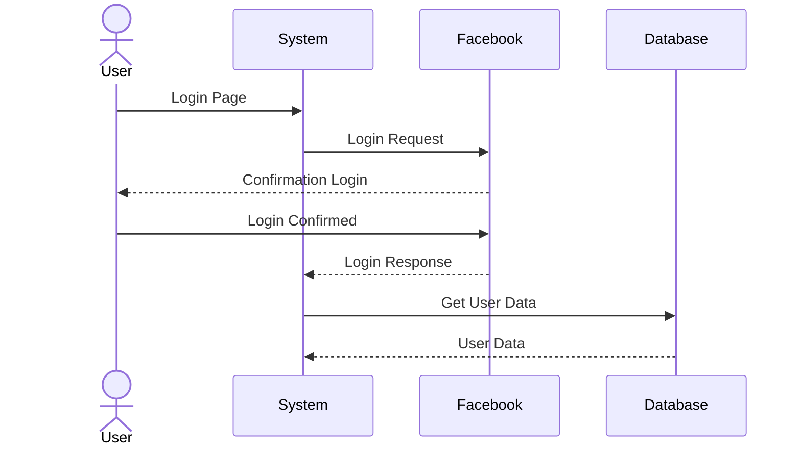

# Sequence Diagrams in Mermaid

With markdown, I can write *simple* text and have it converted to HTML and PDF "auto-magically". This is **really** powerful.

- This is a list item
- This is the next item
  - This is a child item

```html
<h1>Welcome</h1>
```

> Using the [**Markdown Preview Mermaid Support**](https://marketplace.visualstudio.com/items?itemName=bierner.markdown-mermaid) extension, I can write [Mermaid](https://mermaid.js.org/syntax/sequenceDiagram.html) diagrams in markdown and have them rendered in the preview pane.


